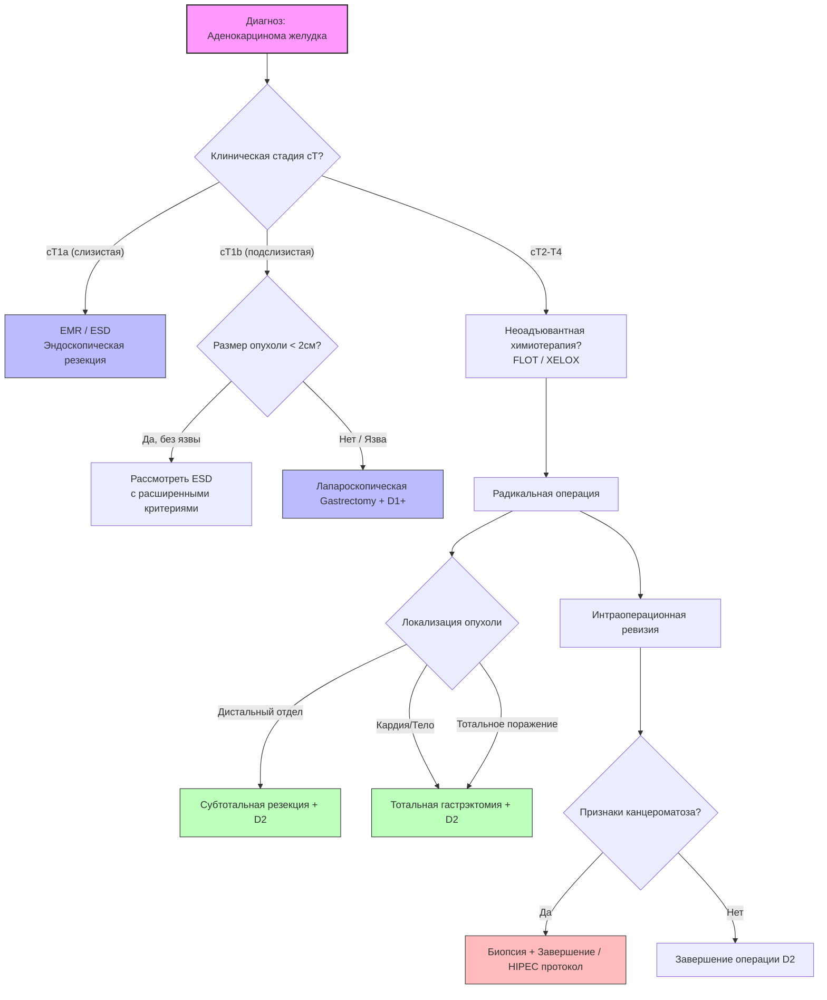
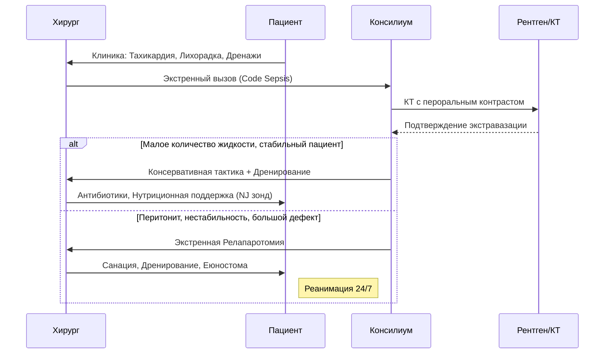

# 🎬 SSVproff® Visual Production Pack
## Пакет производственной документации для визуализации курса "Проблемы Аденокарциномы Желудка 2026"

**Версия:** 1.0  
**Статус:** Готово к производству  
**Автор:** Prof. SSV (AI Assistant)  
**Лицензия:** SSVproff® Internal Use Only

---

## 📂 Раздел 1: Сценарии Видеопродакшена (Video Storyboards)

### Модуль 3: Расширенная лимфодиссекция D2
**Тема:** Станция №7 (по левой желудочной артерии) — Критические точки безопасности.

| Кадр | Время | Визуальный ряд (Что в кадре) | Аудио / Комментарий профессора | Технические требования |
|------|-------|------------------------------|--------------------------------|------------------------|
| **01** | 00:00-00:15 | **Общий план:** Лапароскопическая стойка, монитор с изображением брюшной полости. Руки ассистента натягивают сальник. | "Коллеги, ключ к успеху диссекции станции 7 — это правильная тракция. Смотрите, как ассистент создает натяжение вдоль верхнего края поджелудочной железы." | 4K, 60fps, широкий угол, свет холодный (5600K). |
| **02** | 00:15-00:45 | **Макро (Zoom 2x):** Выделение ствола левой желудочной артерии (ЛЖА). Видна пульсация. Инструмент тупфером аккуратно отделяет клетчатку. | "Здесь находится 'Зона риска'. Обратите внимание на вену, идущую параллельно артерии. Повреждение этой вены — причина 30% интраоперационных кровотечений на этом этапе." | Макро-линза, фокус на сосуде. Наложить графическую стрелку (Post-prod). |
| **03** | 00:45-01:20 | **Схема (Insert):** 3D-анимация наложения поверх видео. Подсветка лимфоузлов красным, сосудов синим/красным. | "Мы используем технику 'En-bloc'. Никакой фрагментации. Лимфоколлектор удаляется единым блоком с жировой клетчаткой." | CGI overlay, прозрачность 80%. |
| **04** | 01:20-02:00 | **Действие:** Наложение клипс на ЛЖА у основания. Проверка гемостаза. | "Клипирование производится проксимальнее и дистальнее. Обязательно проверяем культи на герметичность перед транссекцией." | Четкий фокус на кончике инструмента. |

**🛠 Требования к монтажу:**
*   Цветокоррекция: Усиление контраста красного (сосуды) и желтого (жировая ткань).
*   Графика: Логотип SSVproff® в углу, таймкод, название этапа внизу.
*   Звук: Шум аспиратора приглушен на 15дБ, голос чистый (шумоподавление AI).

---

### Модуль 7: Интракорпоральный анастомоз
**Тема:** Формирование пищеводно-тощекишечного анастомоза (EJ) линейным степлером.

| Кадр | Время | Визуальный ряд | Аудио / Комментарий | Технические требования |
|------|-------|----------------|---------------------|------------------------|
| **01** | 00:00-00:30 | **Вид сверху:** Введение троакара для степлера. Позиционирование наковальни в пищеводе. | "Позиция наковальни определяет геометрию будущего анастомоза. Избегайте перекрута пищевода." | Стабилизация изображения (Gimbal logic). |
| **02** | 00:30-01:10 | **Крупный план:** Смыкание браншей степлера. Контроль ткани между браншами (отсутствие лишних тканей). | "Правило 'Одного Щелчка'. Если ткань зажата неправильно — не форсируйте. Откройте, перепозиционируйте, закройте снова." | Макро, акцент на индикаторе сжатия ткани. |
| **03** | 01:10-02:00 | **Тест:** Введение метиленового синего через зонд. Проверка шва на герметичность. | "Тест на герметичность — это не формальность. Это ваша страховка от несостоятельности. Синяя жидкость не должна появляться снаружи шва." | Высокая экспозиция для видимости подтекания. |

---

## 🎨 Раздел 2: Промты для Генерации Графики (AI Image Generation)

Используйте эти промты в Midjourney v6 или DALL-E 3 для создания уникальных иллюстраций, свободных от авторских прав.

### 1. Анатомическая схема кровоснабжения желудка (Стиль: Медицинский атлас 2026)
```prompt
Professional medical illustration of human stomach arterial blood supply, detailed anatomy, celiac trunk, left gastric artery, right gastric artery, gastroepiploic arteries, clean white background, vector style, high contrast, labels ready space, color coded arteries (red) and veins (blue), 8k resolution, academic textbook style --ar 16:9 --v 6.0 --style raw
```

### 2. 3D визуализация стадий рака желудка (TNM классификация)
```prompt
3D cross-section render of stomach wall layers showing gastric adenocarcinoma progression T1 to T4, mucosa, submucosa, muscularis propria, serosa, tumor invasion depth visualization, realistic tissue texture, clinical lighting, dark background for presentation, high detail, medical accuracy --ar 3:2 --v 6.0
```

### 3. Схема лимфодиссекции D2 (Японская классификация)
```prompt
Schematic diagram of gastric lymph node stations according to Japanese Gastric Cancer Association, numbered stations 1-16, minimalistic design, flat vector art, pastel colors on white, clear numbering, suitable for surgical lecture slide, infographic style --ar 16:9 --v 6.0
```

### 4. Концепт "Хирург будущего" (Для обложки курса)
```prompt
Futuristic surgical concept art, surgeon performing robotic gastrectomy, holographic interface displaying patient CT scan and navigation data, blue and teal color palette, cinematic lighting, hyperrealistic, 8k, symbolizing precision and technology in oncology --ar 16:9 --v 6.0
```

---

## 📊 Раздел 3: Алгоритмы (Mermaid Code)

Скопируйте этот код в любой редактор Mermaid (или вставьте в Markdown-файл с поддержкой Mermaid) для генерации интерактивных схем.

### Алгоритм принятия решения: Объем лимфодиссекции



### Алгоритм ведения осложнений (Несостоятельность швов)



---

## 📝 Раздел 4: Структура Презентаций (Слайды)

### Модуль 1: Эпидемиология и Молекулярная Биология
**Формат:** 16:9, Темный фон (Deep Navy #0a192f), Текст белый/золотой.

*   **Слайд 1: Титульный**
    *   Заголовок: "Аденокарцинома желудка 2026: Новая эра персонализации"
    *   Подзаголовок: "От молекулярных маркеров к прецизионной хирургии"
    *   Визуал: 3D модель рецептора HER2/neu.
    *   Логотип: SSVproff®.

*   **Слайд 2: Глобальная статистика (GLOBOCAN 2025)**
    *   График: Карта мира с тепловой картой заболеваемости.
    *   Ключевые цифры: "3-е место по смертности", "Рост проксимальных форм".
    *   Тезис: "Сдвиг парадигмы: рак кардии требует иного подхода".

*   **Слайд 3: Классификация Lauren & TCGA**
    *   Схема: Сравнение Кишечного vs Диффузного типа.
    *   Таблица: Молекулярные подтипы (EBV+, MSI-H, CIN, GS).
    *   Акцент: "Влияние подтипа на выбор неоадъювантной терапии".

*   **Слайд 4-10:** [Детальное содержание по каждому подтипу с клиническими кейсами].

---

## 📸 Раздел 5: Чек-лист для Операционной Съемки

**Подготовка (Pre-Op):**
- [ ] Проверка баланса белого камер (White Balance) под операционными лампами.
- [ ] Очистка линз лапароскопа и камеры (специальной салфеткой, без разводов).
- [ ] Настройка эндо-видеосистемы на максимальное разрешение (4K UHD).
- [ ] Проверка аудиоканала: микрофон на голове хирурга должен быть включен и протестирован.
- [ ] Удаление лишних предметов из кадра (бутылки с водой, личные вещи).

**Во время операции (Intra-Op):**
- [ ] **Правило тишины:** Во время критических этапов (выделение сосудов, анастомоз) в операционной должна быть тишина для записи чистого комментария.
- [ ] **Стабилизация:** Ассистент камеры должен использовать обе руки, локти прижаты к телу.
- [ ] **Фокус:** Фокус всегда на кончике активного инструмента.
- [ ] **Свет:** Избегать пересвета (blowout) на серозе органов.
- [ ] **Масштаб:** При демонстрации техники делать зум так, чтобы орган занимал 70% кадра.

**Пост-продакшн (Post-Op):**
- [ ] Обезличивание данных пациента (размытие бирок, документов).
- [ ] Добавление субтитров с медицинскими терминами.
- [ ] Вставка графических указателей (стрелки, круги) на ключевые структуры.
- [ ] Экспорт в формате MP4 (H.264) для веба и ProRes 422 для архива.

---

## 🚀 План внедрения визуализации

1.  **Неделя 1:** Генерация всех статических изображений и схем через AI по предоставленным промтам. Верстка презентаций.
2.  **Неделя 2-3:** Организация съемочной смены в операционной. Запись 5 ключевых операций согласно сценариям.
3.  **Неделя 4:** Монтаж видео, наложение графики, озвучка диктором (или профессором).
4.  **Неделя 5:** Сборка модулей на платформе обучения, тестирование интерактивных элементов.

---
*Документ создан в рамках стандартов качества SSVproff®. Любое копирование без разрешения запрещено.*
